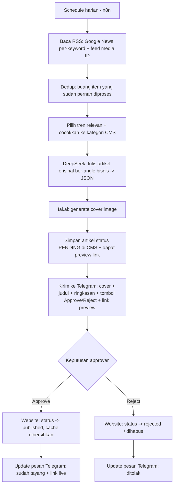

# PRD — Automation Generate Artikel Blog (n8n + DeepSeek + fal.ai + Telegram Approval)

**Produk:** Urban Office — Website Landing Page
**Dokumen:** Product Requirements Document (PRD)
**Versi:** 0.2 (Draft)
**Tanggal:** 2026-08-31
**Status:** Draft — untuk diskusi, belum masuk tahap build
**Pemilik:** Admin Urban Office

> **Changelog v0.2:** Provider LLM tahap testing awal diubah ke **Groq AI (tier gratis)**; DeepSeek dipertahankan sebagai kandidat produksi. LLM diperlakukan *pluggable* (OpenAI-compatible), lihat §9.2.

---

## 1. Ringkasan Eksekutif

Membangun pipeline otomatis yang menghasilkan artikel blog untuk website Urban Office secara terjadwal, dengan pendekatan **news-jacking**: membaca tren berita harian, mencocokkannya dengan kategori bisnis, lalu menulis **artikel orisinal ber-angle bisnis** menggunakan AI. Setiap artikel + cover image dikirim ke **Telegram** untuk **di-approve/reject oleh manusia** sebelum tayang.

Orkestrasi dilakukan di **n8n**. Website (PHP CMS yang sudah ada) hanya menyediakan **endpoint tipis** untuk menerima artikel yang di-approve dan mempublikasikannya. Tidak ada perubahan pada UI editor admin yang sekarang.

---

## 2. Latar Belakang & Masalah

Saat ini pembuatan artikel di CMS ([admin/posts.php](admin/posts.php)) **100% manual**: admin menulis judul, konten (CKEditor), meta SEO, memilih kategori/tag, dan mengunggah gambar satu per satu. Ini lambat, tidak konsisten, dan sulit menjaga frekuensi publish yang dibutuhkan untuk SEO/GEO dan mendukung Quality Score Google Ads.

**Peluang:** skema database CMS sudah bersih dan siap diisi secara terprogram, sehingga generate artikel dapat diotomasi tanpa merombak sistem.

---

## 3. Tujuan & Non-Tujuan

### 3.1 Tujuan (Goals)
- G1. Menghasilkan draft artikel berkualitas secara otomatis & terjadwal tanpa menulis manual.
- G2. Menjaga relevansi konten dengan kategori bisnis (virtual office, coworking, sewa kantor, legalitas/pajak, dsb).
- G3. Menjamin **kontrol kualitas manusia** lewat approval Telegram sebelum publish.
- G4. Konten memenuhi kaidah SEO on-page yang sudah ada di CMS (meta title/description, slug, excerpt, featured image, panjang konten).
- G5. Tidak mengganggu / merombak alur admin manual yang sudah berjalan.

### 3.2 Non-Tujuan (Non-Goals)
- N1. Bukan menggantikan editor manual — jalur manual tetap ada.
- N2. Tidak auto-publish tanpa persetujuan manusia.
- N3. Tidak membangun UI approval baru di dalam website (approval terjadi di Telegram).
- N4. Tidak (untuk v1) melakukan riset keyword mendalam / clustering otomatis di luar pencocokan kategori.
- N5. Tidak menyalin/menjiplak berita — hanya menjadikan tren sebagai *hook*.

---

## 4. Metrik Keberhasilan

| Metrik | Target awal |
|---|---|
| Artikel ter-generate & terkirim ke Telegram / hari | (TBD, mis. 1–3) |
| Approval rate (approve vs total) | ≥ 60% (indikator kualitas prompt) |
| Waktu dari generate → keputusan approve | < 24 jam |
| Artikel lolos SEO score CMS (≥ 5/7 kriteria) | ≥ 90% |
| Insiden konten tidak relevan / off-brand yang lolos publish | 0 |

---

## 5. Aktor & Persona

- **Sistem Automation (n8n):** menjalankan pipeline, memanggil AI, mengirim ke Telegram.
- **Approver (manusia):** menerima notifikasi Telegram, menilai cover + isi, menekan Approve/Reject.
- **Website CMS (PHP):** menerima artikel approved, menyimpan & mempublikasikan; menyediakan taksonomi.
- **Pembaca akhir:** pengunjung blog di [blog/](blog/index.php).

---

## 6. Ruang Lingkup

### 6.1 Termasuk (In Scope)
- Pipeline n8n: schedule → RSS → dedup → matching kategori → DeepSeek → fal.ai → Telegram approval → publish.
- 2–3 endpoint baru di website (taxonomy, ingest/publish, preview).
- User "bot" sebagai author, penyimpanan API key aman (.env), (opsional) kolom `source_url` untuk dedup.

### 6.2 Di Luar Lingkup (Out of Scope)
- Perubahan tampilan front-end blog.
- Analytics/dashboard performa artikel.
- Multi-bahasa.
- Auto-generate halaman non-blog.

---

## 7. Alur End-to-End



---

## 8. Pembagian Tanggung Jawab

| Komponen | Tanggung jawab |
|---|---|
| **n8n** | Scheduling; baca & gabung RSS; dedup; ranking & pencocokan kategori; panggil DeepSeek; panggil fal.ai; kirim & tangani callback Telegram; panggil endpoint website |
| **Website (PHP)** | Sediakan taksonomi; terima artikel (simpan sebagai pending/draft); download & simpan cover image lokal; sediakan preview aman; publish/reject saat diperintah; anti-duplikat slug |
| **Telegram** | Kanal approval: menampilkan cover + isi + tombol Approve/Reject |
| **Manusia (approver)** | Menilai kualitas & relevansi, memutuskan tayang/tolak |

---

## 9. Kebutuhan Fungsional

### 9.1 Pengambilan Konten (n8n)
- FR-1. Sistem membaca RSS dari **kombinasi**: Google News RSS per-keyword bisnis **dan** feed media Indonesia (mis. kanal Ekonomi/Bisnis Detik, Kompas, CNN Indonesia, Antara).
- FR-2. Sistem mendedup item agar satu berita/tren tidak diproses dua kali (berdasarkan URL sumber / judul).
- FR-3. Sistem mencocokkan item tren dengan **kategori yang ada di CMS** (diambil via endpoint taksonomi). Item yang tidak cocok kategori manapun **di-skip** (bukan dipaksakan).

### 9.2 Generasi Konten (LLM — Groq untuk testing, pluggable)

**Strategi provider LLM.** LLM diperlakukan sebagai komponen yang dapat ditukar (**pluggable**) karena semua kandidat memakai API **OpenAI-compatible** — cukup ganti `base_url`, API key, dan nama model di n8n, tanpa mengubah struktur pipeline.

| Tahap | Provider | Model kandidat | Catatan |
|---|---|---|---|
| **Testing awal (sekarang)** | **Groq AI (gratis)** | `llama-3.3-70b-versatile` (atau `llama-3.1-8b-instant` untuk cepat/hemat) | Endpoint `https://api.groq.com/openai/v1`. Gratis dengan rate limit; cukup untuk validasi alur & kalibrasi prompt. |
| **Produksi (kandidat)** | DeepSeek | `deepseek-chat` | Endpoint `https://api.deepseek.com`. Murah, bahasa Indonesia baik. Dipakai bila kualitas Groq kurang / rate limit gratis mengganggu. |

> Karena OpenAI-compatible, perpindahan Groq → DeepSeek (atau sebaliknya) tidak mengubah kontrak JSON (§10) maupun endpoint website.

- FR-4. Menghasilkan **artikel orisinal ber-angle bisnis** — tren hanya sebagai hook, bukan rewrite/rangkuman berita.
- FR-5. Output berupa **JSON terstruktur** berisi minimal: `title`, `excerpt`, `content` (HTML bersih: `<h2>/<h3>/<p>/<ul>`), `meta_title`, `meta_description`, `category` (nama), `tags` (array), `image_prompt`.
- FR-6. Konten memenuhi ambang SEO CMS: judul mengandung keyword, konten **≥ 300 kata** (ideal 800+), meta title 50–60 char, meta description 120–160 char.
- FR-7. Gaya bahasa Indonesia, informatif, dan menyisipkan CTA/relevansi layanan Urban Office secara wajar (tidak spammy).

### 9.3 Generasi Gambar (fal.ai)
- FR-8. Membuat **satu cover image** per artikel dari `image_prompt` (mis. model FLUX).
- FR-9. Gambar diteruskan ke website (via URL) dan **disimpan lokal** ke `assets/images/blog/` (URL fal.ai bisa kadaluarsa).

### 9.4 Endpoint Website
- FR-10. **`GET taxonomy`** — mengembalikan daftar `categories` & `tags` (id, name, slug) untuk pencocokan di n8n.
- FR-11. **`POST ingest`** — menerima payload artikel, memvalidasi, mengunduh cover, meng-`INSERT` artikel dengan status **`pending`** (belum tayang), mengembalikan `post_id`, `preview_url`, `edit_url`.
  - Slug auto-generate + penanganan duplikat (pakai logika yang sudah ada).
  - Kategori diterima **berdasarkan nama** → di-resolve ke ID (kebijakan auto-create / fallback = **Open Question OQ-2**).
  - `published_at` **wajib NULL** saat pending (lihat Constraint C-1).
- FR-12. **`POST approve`** — mengubah status artikel `pending → published`, set `published_at = NOW()`, bersihkan cache.
- FR-13. **`POST reject`** — mengubah status `pending → rejected` (atau hapus permanen — **OQ-3**).
- FR-14. **`GET preview`** — menampilkan artikel `pending` via token aman, agar approver bisa membaca konten penuh sebelum memutuskan.

### 9.5 Approval Telegram (n8n)
- FR-15. Mengirim pesan berisi **cover image + judul + excerpt/ringkasan + tombol inline [✅ Approve] [❌ Reject] + link preview** (karena caption Telegram terbatas ~1024 karakter, isi penuh diakses lewat preview link).
- FR-16. Menangkap callback tombol, memanggil endpoint `approve`/`reject`, lalu **memperbarui pesan** menjadi status akhir (tayang + link live / ditolak).
- FR-17. Mencatat siapa yang approve/reject & kapan (untuk audit).

---

## 10. Kontrak Data (Draft)

### 10.1 `POST ingest` — request body
```json
{
  "title": "string (wajib)",
  "excerpt": "string",
  "content": "string HTML (wajib)",
  "meta_title": "string",
  "meta_description": "string",
  "category": "string nama kategori",
  "tags": ["string", "..."],
  "image_url": "https://fal.../cover.png",
  "source_url": "https://sumber-berita/... (untuk dedup)",
  "image_alt": "string alt text SEO"
}
```

### 10.2 `POST ingest` — response
```json
{
  "ok": true,
  "post_id": 123,
  "status": "pending",
  "preview_url": "https://.../blog/preview?id=123&token=...",
  "edit_url": "https://.../admin/posts.php?action=edit&id=123"
}
```

### 10.3 LLM (Groq/DeepSeek) — format keluaran (untuk prompt)
Sama dengan field pada 10.1 (tanpa `image_url`/`source_url` yang diisi tahap lain). `content` harus HTML semantik bersih tanpa `<html>/<body>`. Minta model membalas **hanya JSON valid** (gunakan mode/JSON response bila tersedia; Groq mendukung `response_format: json_object`).

---

## 11. Skema Data & Perubahan DB

Tabel target sudah ada: `posts`, `post_categories`, `post_tags`, `categories`, `tags` (lihat [inc/init_db.php](inc/init_db.php)).

Perubahan yang diusulkan:
- **P-1.** Tambah nilai status `pending` dan `rejected` (kolom `status` sudah `VARCHAR`, jadi tanpa migrasi struktur — cukup konvensi).
- **P-2.** Tambah kolom `source_url VARCHAR(255) NULL` di `posts` untuk dedup berlapis (opsional tapi disarankan).
- **P-3.** Buat 1 user "bot" di tabel `users` sebagai `author_id` artikel otomatis.
- **P-4.** (Opsional) kolom `preview_token` / mekanisme token untuk preview aman.

---

## 12. Kebutuhan Non-Fungsional

- **Keamanan:**
  - NFR-1. Endpoint machine-to-machine diproteksi **Bearer token** yang disimpan di `.env` (tidak di-commit; tambahkan ke `.gitignore`).
  - NFR-2. Endpoint ingest/approve/reject hanya menerima token valid; endpoint preview pakai token acak per-artikel.
  - NFR-3. Validasi & sanitasi payload; `content` HTML difilter dari elemen berbahaya (mis. `<script>`).
  - NFR-4. Rate limiting wajar untuk mencegah abuse.
- **Performa:** NFR-5. Proses ingest 1 artikel < 5 detik (di luar waktu AI/gambar yang ditangani n8n).
- **Biaya:** NFR-6. Pantau biaya DeepSeek (murah) & fal.ai per gambar; batasi volume harian.
- **Keandalan:** NFR-7. Kegagalan di satu item tidak menghentikan batch; ada logging.
- **Auditability:** NFR-8. Semua approve/reject & publish tercatat (reuse `log_activity` / `activity_logs`).

---

## 13. Batasan & Asumsi (Constraints & Assumptions)

- **C-1 (KRITIS).** Fungsi `auto_publish_scheduled_posts()` ([inc/functions.php:240](inc/functions.php:240)) memiliki query *catch-up* yang **otomatis mem-publish draft** jika `published_at <= NOW()` **dan** `created_at < hari ini`. → Artikel pending/draft otomatis **HARUS** disimpan dengan `published_at = NULL` (atau tanggal masa depan), agar tidak tayang sendiri sebelum di-approve.
- **C-2.** Konten disimpan sebagai **HTML** (bukan Markdown); DeepSeek harus mengeluarkan HTML bersih.
- **C-3.** Caption foto Telegram terbatas ~1024 karakter → isi penuh diakses via **preview link**, bukan dikirim penuh sebagai caption.
- **A-1.** n8n mampu menyimpan state & menangani Telegram callback (async approval).
- **A-2.** Kredensial LLM (Groq untuk testing; DeepSeek untuk produksi), fal.ai, Telegram Bot, dan token website tersedia.
- **A-3.** Kategori di CMS sudah/akan diisi sesuai lini bisnis untuk pencocokan.

---

## 14. Risiko & Mitigasi

| Risiko | Dampak | Mitigasi |
|---|---|---|
| Konten AI tidak akurat / off-brand | Reputasi | Approval manusia via Telegram (wajib) |
| Duplikat/menjiplak berita | SEO buruk, copyright | Angle orisinal (FR-4), dedup (FR-2, P-2) |
| Draft tayang sendiri sebelum approve | Konten mentah publik | `published_at = NULL` (C-1) |
| URL gambar fal.ai kadaluarsa | Gambar rusak | Download & simpan lokal (FR-9) |
| Token endpoint bocor | Injeksi konten | Bearer token di `.env`, sanitasi, rate limit (NFR-1..4) |
| Volume berlebih → biaya AI membengkak | Biaya | Batasi jumlah/hari (NFR-6) |

---

## 15. Pertanyaan Terbuka / Keputusan Tertunda

- **OQ-1. Penyimpanan state pending:** simpan artikel di DB sejak awal (status `pending`, memudahkan preview & audit — **rekomendasi**) **atau** n8n menahan konten dan baru kirim ke website saat approve?
- **OQ-2. Kategori tak dikenal:** auto-create kategori baru (**rekomendasi**) atau fallback ke kategori default / skip artikel?
- **OQ-3. Perilaku Reject:** ubah status jadi `rejected` (arsip, bisa ditinjau) atau hapus permanen?
- **OQ-4. Deployment:** n8n & website di lokal Laragon yang sama, atau website di server produksi? (memengaruhi URL & jaringan token)
- **OQ-5. Daftar keyword & feed:** keyword Google News mana & feed media mana yang dipakai?
- **OQ-6. Volume & jadwal:** berapa artikel/hari & jam berapa dijalankan?
- **OQ-7. Approver:** siapa saja yang boleh approve (satu chat/grup Telegram? whitelist user id?).
- **OQ-8. Publish setelah approve:** langsung `published`, atau tetap `draft` untuk cek final di CMS?

---

## 16. Fase / Milestone (Usulan)

- **M0 — Finalisasi PRD** (dokumen ini): jawab OQ-1..8.
- **M1 — Fondasi website:** user bot, `.env` + loader, kolom `source_url`, endpoint `taxonomy`.
- **M2 — Ingest & preview:** endpoint `ingest` (status pending, download gambar), `preview` bertoken.
- **M3 — Approve/Reject:** endpoint `approve` & `reject`, logging.
- **M4 — Pipeline n8n:** RSS combo → dedup → matching → LLM (Groq gratis) → fal.ai → ingest.
- **M5 — Telegram approval:** kirim cover+ringkasan+tombol, tangani callback, update pesan.
- **M6 — Uji coba & tuning prompt:** kalibrasi kualitas, ukur approval rate.

---

## 17. Lampiran — Kerangka Prompt LLM (Draft, berlaku untuk Groq/DeepSeek)

> *Sistem:* "Kamu penulis konten SEO untuk Urban Office (penyedia virtual office, coworking, sewa kantor, layanan legalitas & pajak di Indonesia/Surabaya). Tulis artikel **orisinal** berbahasa Indonesia yang terinspirasi dari tren berikut, TANPA menyalin berita. Arahkan ke relevansi bisnis Urban Office secara natural."
>
> *Input:* judul tren, ringkasan tren, daftar kategori yang tersedia.
>
> *Output:* **JSON** dengan field `title, excerpt, content(HTML), meta_title, meta_description, category, tags[], image_prompt` sesuai batasan panjang di FR-6.

---

*Catatan: Angka target, daftar keyword, dan keputusan OQ akan diisi pada finalisasi (M0).*
