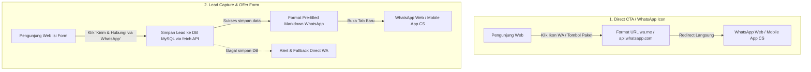

# Rekapitulasi & Analisis Template Pesan WhatsApp Masuk
**Project:** Clone Website Urban Office (PHP Native)  
**Dokumentasi:** Arsitektur Pesan WhatsApp, Pemetaan Halaman, & Evaluasi Sistem

---

## 1. Arsitektur Alur Pesan Masuk WhatsApp

Website Urban Office mengintegrasikan WhatsApp sebagai kanal konversi utama (*closing channel*). Secara sistem, terdapat 2 alur masuk utama:



---

## 2. Katalog Lengkap Template Pesan WhatsApp

Berikut adalah pemetaan detail setiap template pesan WhatsApp yang terpasang di seluruh kode sumber:

### 2.1 Formulir Kontak & Pengajuan Penawaran Dinamis
*File Sumber: [`assets/js/main.js`](assets/js/main.js#L327-L348)*

#### A. Mode Pengajuan Penawaran (*Offer Mode*)
Dipicu ketika pengunjung menekan tombol **"Ajukan Penawaran"** di kartu harga atau tombol CTA spesifik:
```text
Halo Urban Office, saya *{name}*.

*Saya ingin mengajukan penawaran untuk:* {service} (Paket {offerPackage})
*Cabang / Lokasi:* {locationVal}
*Ekspektasi Budget:* {budgetVal}
*Pesan:* {pesanVal}

*Email:* {email}
*No. HP:* {phone}
```

#### B. Mode Konsultasi & Jadwal Kunjungan Biasa
Dipicu ketika pengunjung mengisi formulir kontak standar:
```text
Halo Urban Office, saya *{name}*.

*Saya ingin berkonsultasi mengenai:* {service}
*Email:* {email}
*No. HP:* {phone}
*Jumlah Orang:* {peopleVal} Orang
*Tanggal:* {dateVal}
```

---

### 2.2 Floating Widget & Konfigurasi Global

| Lokasi / File | Komponen | Isi Template Pesan |
| :--- | :--- | :--- |
| [`inc/footer.php`](inc/footer.php#L110) | Floating WhatsApp Widget (Kanan Bawah Layar) | `Halo Urban Office, saya tertarik dengan layanan Urban Office. Mohon info selengkapnya.` |
| [`inc/config.php`](inc/config.php#L46) | Konstanta `WHATSAPP_MESSAGE` | `Halo, saya ingin menanyakan perihal layanan Urban Office.` |

---

### 2.3 Halaman Cabang & Pemilihan Lokasi Kantor

| Lokasi / File | Pemicu / Tombol | Isi Template Pesan |
| :--- | :--- | :--- |
| [`inc/components/branches.php`](inc/components/branches.php#L127) | Ikon WhatsApp pada Kartu Cabang | `Halo Urban Office, saya ingin bertanya mengenai ketersediaan layanan dan harga untuk lokasi berikut:`<br><br>`Cabang: *{branch_name}*`<br>`Lokasi: {branch_location}` |
| [`lokasi-urban-office/index.php`](lokasi-urban-office/index.php#L190) | Ikon WhatsApp di Jaringan Cabang | `Halo Urban Office, saya ingin bertanya mengenai ketersediaan layanan dan harga untuk lokasi berikut:`<br><br>`Cabang: *{title}*`<br>`Alamat: {address}` |
| [`lokasi-urban-office/detail.php`](lokasi-urban-office/detail.php#L121) | Tombol Hero "Hubungi Cabang Ini" | `Halo Urban Office, saya tertarik untuk bertanya seputar layanan dan fasilitas di cabang {short_title}` |
| [`lokasi-urban-office/detail.php`](lokasi-urban-office/detail.php#L486) | Slider "Cabang Lainnya" | `Halo Urban Office, saya tertarik dengan layanan di Cabang *{title}*` |
| [`inc/components/locations_showcase.php`](inc/components/locations_showcase.php#L58) | Tombol "Pilih Alamat" (Bundling Legalitas) | `Halo Urban Office, saya ingin memilih alamat Virtual Office di {title} untuk paket bundling {package_label}.` |

---

### 2.4 Paket Ruang Kerja Fisik & Fasilitas per Cabang
*Basis Data: [`inc/locations_data.php`](inc/locations_data.php) & Halaman Detail: [`lokasi-urban-office/detail.php`](lokasi-urban-office/detail.php)*

* **Virtual Office:**
  * Starter: `Halo Urban Office, saya ingin memesan Virtual Office Starter di Cabang {Cabang}.`
  * Luxury: `Halo Urban Office, saya tertarik dengan Virtual Office Luxury di Cabang {Cabang}.`
  * Priority: `Halo Urban Office, saya tertarik dengan Virtual Office Priority di Cabang {Cabang}.`
* **Coworking & Hot Desk:**
  * Hot Desk Harian: `Halo Urban Office, saya mau booking Hot Desk harian di Cabang {Cabang}.`
  * Coworking Bulanan: `Halo Urban Office, saya mau sewa Coworking Bulanan di Cabang {Cabang}.`
* **Private Office:**
  * `Halo Urban Office, saya ingin survey Private Serviced Office di Cabang {Cabang}.`
* **Meeting Room:**
  * Sewa Reguler: `Halo Urban Office, saya mau sewa Meeting Room di Cabang {Cabang}.`
  * Klaim Member VO: `Halo Urban Office, saya ingin bertanya cara klaim jatah Meeting Room dari paket Virtual Office di Cabang {Cabang}.`
* **Event Space:**
  * Half-Day: `Halo Urban Office, saya ingin menanyakan sewa Event Space Half-Day di Cabang {Cabang}.`
  * Full-Day: `Halo Urban Office, saya ingin menanyakan sewa Event Space Full-Day di Cabang {Cabang}.`
* **Sharing Room Office:**
  * `Halo Urban Office, saya tertarik menyewa Sharing Room Office di Cabang {Cabang}.`

---

### 2.5 Halaman Layanan Legalitas & Pendirian Usaha

| Halaman | Tombol Hero CTA | Tombol Kartu Paket (*Pricing Cards*) |
| :--- | :--- | :--- |
| **Pendirian PT Badan Usaha**<br>([`pendirian-pt-include-virtual-office`](pendirian-pt-include-virtual-office/index.php)) | `Halo Urban Office, saya tertarik dengan paket Bundling PT Badan Usaha + Virtual Office. Mohon info selengkapnya.` | • `Halo Urban Office, saya tertarik paket Jasa PT Badan (< 1 Miliar) seharga 3.7 Juta.`<br>• `Halo Urban Office, saya tertarik paket PT Badan (< 1 M) + VO Starter seharga 8.32 Juta.`<br>• `Halo Urban Office, saya tertarik paket PT Badan (< 1 M) + VO Luxury seharga 11.14 Juta.`<br>• `Halo Urban Office, saya tertarik paket PT Badan (< 1 M) + VO Priority seharga 12.94 Juta.` *(dan varian Modal > 1 Miliar)* |
| **Pendirian CV**<br>([`pendirian-cv-virtual-office`](pendirian-cv-virtual-office/index.php)) | `Halo Urban Office, saya tertarik dengan paket Bundling CV + Virtual Office. Mohon info selengkapnya.` | • `Halo Urban Office, saya tertarik paket Jasa Pendirian CV seharga 2.7 Juta.`<br>• `Halo Urban Office, saya tertarik paket Pendirian CV + VO Starter seharga 7.32 Juta.`<br>• `Halo Urban Office, saya tertarik paket Pendirian CV + VO Luxury seharga 10.14 Juta.`<br>• `Halo Urban Office, saya tertarik paket Pendirian CV + VO Priority seharga 11.94 Juta.` *(dan varian Jasa Perubahan CV)* |
| **PT Perorangan**<br>([`pendirian-perorangan-plus-virtual-office`](pendirian-perorangan-plus-virtual-office/index.php)) | `Halo Urban Office, saya tertarik dengan paket Bundling PT Perorangan + Virtual Office. Mohon info selengkapnya.` | • `Halo Urban Office, saya tertarik paket Jasa PT Perorangan & Akta seharga 2.2 Juta.`<br>• `...paket PT Perorangan & Akta + VO Starter seharga 6.82 Juta.`<br>• `...paket PT Perorangan (Tanpa Akta) + VO Starter seharga 5.62 Juta.` *(dan varian Luxury/Priority)* |
| **Pendirian PMA**<br>([`pendirian-pma-plus-virtual-office`](pendirian-pma-plus-virtual-office/index.php)) | `Halo Urban Office, saya tertarik dengan paket Bundling PT PMA + Virtual Office. Mohon info selengkapnya.` | • `Halo Urban Office, saya tertarik paket Jasa Pendirian PMA.`<br>• `Halo Urban Office, saya tertarik paket PT PMA + VO Starter.` *(dan varian Luxury/Priority)* |
| **Perizinan & Perubahan**<br>([`perizinan-dan-perubahan-perusahaan`](perizinan-dan-perubahan-perusahaan/index.php)) | `Halo Urban Office, saya tertarik dengan Layanan Perizinan dan Perubahan PT. Mohon info selengkapnya.` | • `Halo Urban Office, saya tertarik paket Jasa Penerbitan NIB seharga 900 Ribu.`<br>• `...paket Penerbitan NIB + VO Starter seharga 5.52 Juta.`<br>• `...paket Perubahan PT KBLI seharga 4.2 Juta.`<br>• `...paket Perubahan PT Pengurus seharga 3.7 Juta.` |

---

### 2.6 Layanan Pajak, Akuntansi, Kemitraan, & Admin

1. **Pajak & Akuntansi ([`pajak-dan-akunting/index.php`](pajak-dan-akunting/index.php#L903)):**
   * Hero CTA: `Halo Urban Office, saya tertarik dengan Jasa Konsultan Pajak. Mohon info selengkapnya.`
   * Konsultasi 30 Menit: `Halo Urban Office, saya ingin tanya detail mengenai layanan Jasa Konsultan Pajak (Rp 399.000/30 Menit).`
   * Paket Pintar Pajak: `Halo Urban Office, saya ingin tanya detail mengenai layanan Paket Pintar Pajak (Mulai Rp 5.470.000/tahun).`
   * Paket Tuntas Pajak: `Halo Urban Office, saya ingin tanya detail mengenai layanan Paket Tuntas Pajak (Mulai Rp 11.910.000/tahun).`
   * Paket Lengkap Pajak: `Halo Urban Office, saya ingin tanya detail mengenai layanan Paket Lengkap Pajak (Mulai Rp 13.760.000/tahun).`
   * Paket PMA Perpajakan: `Halo Urban Office, saya ingin tanya detail mengenai Paket PMA perpajakan.`
   * Pembuatan PKP: `Halo Urban Office, saya ingin tanya detail mengenai Jasa Pembuatan PKP (Mulai Rp 700.000).`

2. **Kemitraan Properti ([`kemitraan-urban-office/index.php`](kemitraan-urban-office/index.php#L16)):**
   * CTA: `Saya tertarik dengan kemitraan Urban Office`

3. **Artikel Blog Otomatis ([`_api/lib_content.php`](_api/lib_content.php#L340)):**
   * CTA Footer Artikel: `Halo Urban Office, saya tertarik dengan layanan kantor & virtual office. Boleh info lengkapnya?`

4. **Follow-up Outbound dari Admin Panel ([`admin/leads.php`](admin/leads.php#L203)):**
   * Tombol "WA Follow-up": `Halo {name}, terima kasih telah menghubungi Urban Office perihal {service}.`

---

## 3. Analisis & Evaluasi Sistem Template

### 3.1 Kelebihan Sistem Saat Ini
> [!TIP]
> **Poin Positif Konversi:**
> 1. **Konteks Spesifik (High Conversion Readiness):** Calon konsumen langsung membawa konteks layanan yang jelas (misal: cabang mana, harga berapa, paket apa). CS tidak perlu membuang waktu menanyakan ulang kebutuhan dasar.
> 2. **Double-Action Data Capture:** Data penawaran dijamin tidak hilang karena disimpan di database terlebih dahulu sebelum browser dialihkan ke WhatsApp.
> 3. **Format Rapi & Terstruktur:** Penggunaan Markdown tebal (`*teks*`) dan baris baru (`\n`) membuat lead terlihat profesional bagi pihak CS.

---

### 3.2 Kekurangan & Area of Improvement (Evaluasi Kritis)

> [!WARNING]
> **1. Hardcoded Nomor Telepon (Prioritas Utama):**
> * Nomor `6285107620100` ditulis langsung secara manual (*hardcoded*) di puluhan file PHP dan JS.
> * Walaupun website memiliki konstanta `WHATSAPP_NUMBER` di [inc/config.php](inc/config.php) serta menu admin [admin/settings.php](admin/settings.php), pengubahan nomor di menu admin tidak berdampak ke tombol-tombol hardcoded tersebut.

> [!NOTE]
> **2. Inkonsistensi Pola Kalimat & Kesopanan:**
> * Halaman Kemitraan terlalu singkat: `"Saya tertarik dengan kemitraan Urban Office"` (tanpa salam dan penutup).
> * Halaman Legalitas & Cabang sangat sopan: `"Halo Urban Office, saya tertarik..."`.
> * *Saran:* Selaraskan semua template agar memiliki salam pembuka, maksud, dan ajakan penutup.

> [!NOTE]
> **3. Ketiadaan Parameter Sumber / Pelacakan (Tracking Attribution):**
> * Jika ada pesan masuk dari Floating Widget, CS tidak tahu halaman mana yang memicu klik tersebut (apakah dari Beranda, Galeri, atau Kontak).
> * *Saran:* Berikan tag ringkas seperti `[Sumber: Floating Widget - {Nama Halaman}]`.

---

## 4. Rekomendasi Solusi & Rencana Perbaikan

1. **Sentralisasi Nomor WhatsApp:**
   Ubah semua string hardcoded `6285107620100` menjadi:
   * Pada PHP: `<?php echo defined('WHATSAPP_NUMBER') ? WHATSAPP_NUMBER : '6285107620100'; ?>`
   * Pada JS: Oper nilai nomor WhatsApp melalui atribut data HTML (misal: `data-wa="<?php echo WHATSAPP_NUMBER; ?>"`) atau global JavaScript variable.
2. **Penyempurnaan Template Kemitraan:**
   Ubah menjadi:
   `Halo Tim Kemitraan Urban Office, saya tertarik dengan peluang kerjasama properti. Boleh minta informasi syarat dan skema kemitraannya?`
3. **Pemberian Kode Referensi Lead:**
   Pada form submit, sertakan `ID Lead: #{id}` ke dalam format pesan WhatsApp agar CS bisa langsung mencocokkannya dengan tabel admin dashboard.
